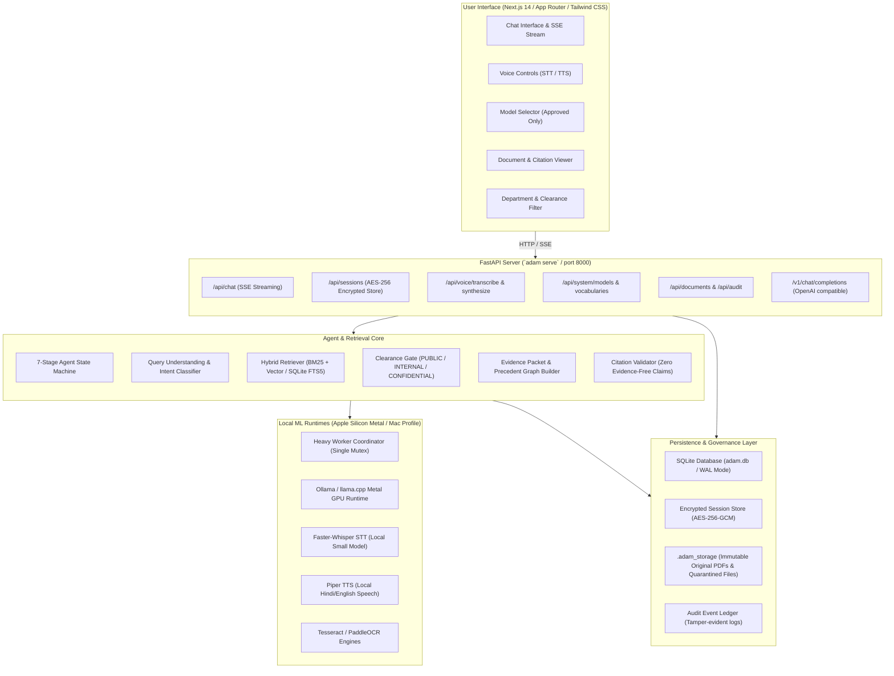

# ADAM — System Context & Complete Architecture Reference

**ADAM (Administrative Document Acquisition and Management)** is an on-premise, privacy-preserving, governance-hardened AI assistant and document intelligence platform engineered for the **Government of Uttarakhand, India**.

ADAM processes official government records — including Government Orders (GOs / शासनादेश), Gazette notifications (राजपत्र), circulars (परिपत्र), statutory rules (नियमावली), and financial audit manuals — across departments such as Finance, Rural Development, Revenue, Audit, and Personnel.

---

## 1. System Architecture Overview



---

## 2. Directory Structure

```
/Users/anuragksingh/Desktop/ADAM/
├── adam/                           # Core Python Package
│   ├── agent/                      # State Machine & Agent Orchestration
│   │   ├── state_machine.py        # 7-Stage state machine with strict single-pass bounds
│   │   └── tools.py                # Read-only search and citation exploration tools
│   ├── api/                        # FastAPI Web Server
│   │   ├── app.py                  # App factory, lifespan, CORS, middleware
│   │   ├── deps.py                 # Dependency injection (DB session, UserContext)
│   │   ├── routers/                # Sub-routers: chat, sessions, voice, system, docs
│   │   └── voice/                  # STT (Faster-Whisper) & TTS (Piper) engines
│   ├── connectors/                 # Portal Scrapers & Data Harvesters
│   │   ├── base.py                 # BaseConnector interface & rate limiter
│   │   ├── crawler.py              # Recursive bounded URL crawler
│   │   ├── itda.py                 # ITDA portal connector
│   │   └── uk_treasury.py          # Uttarakhand Treasuries / IFMS connector
│   ├── db/                         # Database Schema & Session Engine
│   │   ├── models.py               # SQLAlchemy ORM models (Documents, Chunks, Audit)
│   │   └── session.py              # Engine factory, WAL pragmas, init_db()
│   ├── evaluation/                 # Metrics & Benchmarking
│   │   ├── metrics.py              # nDCG@k, citation coverage, WER, CER, latency
│   │   └── gold_set.py             # Curated golden evaluation queries
│   ├── extract/                    # Extraction & OCR Pipeline
│   │   ├── blocks.py               # Bounding box & block-level extraction
│   │   ├── metadata.py             # Official metadata parsing (GO numbers, dates)
│   │   ├── ocr.py                  # Pluggable OCR: Tesseract, PaddleOCR, Null
│   │   ├── pdf.py                  # PyMuPDF digital text extractor
│   │   ├── pipeline.py             # Idempotent document processing pipeline
│   │   ├── precedents.py           # Precedent relationship & supersession parser
│   │   ├── preprocess.py           # Image rotation & grayscale binarization
│   │   └── quality.py              # Page quality gate (flags scanned/low confidence)
│   ├── ingest/                     # Ingestion Validation & Quarantine
│   │   └── validator.py            # PDF header check, malware JS filter, quarantine
│   ├── memory/                     # Session & Retention Management
│   │   ├── crypto.py               # AES-256-GCM field-level encryption
│   │   ├── preferences.py          # Officer preferences (language, department)
│   │   ├── retention.py            # 30-day auto-purge of expired sessions
│   │   └── session.py              # Encrypted chat history & isolation
│   ├── model/                      # Model Governance & Runtime
│   │   ├── registry.py             # Pinned models: Qwen2.5/3, Gemma-3, Llama-3.2
│   │   └── runtime.py              # SingleModelLifecycleManager & Metal/Ollama runtimes
│   ├── rag/                        # Retrieval-Augmented Generation Engine
│   │   ├── chunker.py              # Section-aware semantic chunking
│   │   ├── generator.py            # Cited response generator & CitationValidator
│   │   ├── models.py               # ParsedQuery, EvidencePacket, Citation dataclasses
│   │   ├── precedents.py           # Precedent graph & amendment resolver
│   │   ├── query.py                # Query understanding & intent classifier
│   │   └── retriever.py            # Hybrid BM25 + Vector retriever with RBAC/ACL
│   ├── resources/                  # Resource Coordinator & Hardware Bounds
│   │   └── coordinator.py          # Mutex for single heavy inference worker on Mac
│   ├── backup.py                   # Crash-consistent backup & disaster recovery
│   ├── cli.py                      # Click CLI (`adam ingest`, `adam serve`, etc.)
│   ├── config.py                   # Central settings, paths, environment variables
│   ├── security.py                 # XSS sanitization, prompt injection defense
│   ├── storage.py                  # Content-addressable file storage (`.adam_storage`)
│   └── vocabularies.py             # Controlled enums (Classification, DocType, etc.)
├── tests/                          # Comprehensive Pytest Test Suite (50+ files, 290+ tests)
├── ui/                             # Next.js 14 Frontend Application
│   ├── app/                        # App Router (`page.tsx`, `layout.tsx`, `globals.css`)
│   ├── components/                 # ChatWindow, CitationCard, CurrencyBanner, VoiceControls
│   ├── lib/                        # API client (`api.ts`), Types (`types.ts`)
│   └── public/                     # Static assets & government insignia
├── .github/workflows/ci.yml        # Continuous Integration automation
└── pyproject.toml                  # Python package configuration & dependencies
```

---

## 3. Detailed Summary of Implemented Phases

### Phase 01: Data Acquisition & Source Governance (`01-data-acquisition.md`)
- **Approved Source Register**: Only whitelisted portals (`itda.uk.gov.in`, `treasury.uk.gov.in`, `e-gazette.uk.gov.in`) are crawlable.
- **Content-Addressable Storage**: All files stored by SHA-256 content hash in `.adam_storage/` preserving immutable originals.
- **Pre-Ingestion Security Filter**: Strict PDF header checking (`%PDF-`), file size bounds (50MB max), and regex scanning for malicious execution payloads (`/JavaScript`, `/Launch`, `/EmbeddedFiles`).
- **Audit Logging**: Every fetch, download, hash verification, and quarantine action recorded in `audit_events`.

### Phase 02: Document Processing, Extraction & OCR (`02-document-processing-ocr.md`)
- **Dual-Engine Extraction**: PyMuPDF extracted digital text; Tesseract / PaddleOCR invoked for scanned pages.
- **Block-Level Geometry**: Text extracted into structured `TextBlock` entities with `[x0, y0, x1, y1]` bounding boxes and reading order.
- **Page Quality Gate**: Pages evaluated for low confidence (<85%), low char yield (<20 chars), and mixed Devanagari/Latin scripts.
- **Idempotent Processing**: Re-running pipelines cleanly updates versions without duplicate chunk creation.

### Phase 03: Retrieval-Augmented Generation & Citations (`03-retrieval-rag-citations.md`)
- **Semantic Chunking**: 300–800 token chunks bounded by structural headings and paragraph breaks.
- **Multi-Level ACL**: Document classification levels (`PUBLIC`, `INTERNAL`, `CONFIDENTIAL`). Searches enforce user clearance at database query time.
- **Precedent & Currency Engine**: Links amending and superseded orders; generates explicit `CurrencyBanner` warnings when an order has been superseded.
- **Citation Precision**: Every material claim (dates, amounts, rule numbers) validated against the evidence packet. Zero evidence yields explicit abstention: *"I could not establish this from the approved repository."*

### Phase 04: Model & Agent Architecture (`04-model-agent-architecture.md`)
- **Strict Temperature Bounding**: Generation strictly constrained to $0.0 \le T \le 0.2$ to eliminate hallucination in administrative contexts.
- **Canonical Model Registry**: Pinned models with SBOM and license auditing (`qwen3-4b-instruct-q4`, `qwen2.5-3b-instruct-q4`, `gemma-3-4b-it-q4`, `llama-3.2-3b-instruct-q4`).
- **7-Stage Bounded State Machine**: Single retrieval pass, single answer pass, guaranteed termination, and secret redaction.

### Phase 05: Session Management, Memory & Retention (`05-session-management-retention.md`)
- **Encrypted Session History**: Chat turns encrypted at rest using AES-256-GCM.
- **Automatic 30-Day Retention**: Scheduled or manual purge sweeps erase expired sessions and zeroize deleted turns.
- **Officer Preferences**: Configurable per-user default language (Hindi/English) and department scoping.

### Phase 06: Resource Budgets & Mac Profile (`06-resource-budgets-coordinator.md`)
- **Apple Silicon Unified Memory Protection**: Hardware coordinator strictly enforces a single heavy task at any moment on Mac (Inference OR OCR, never concurrent).
- **Headroom Monitoring**: Enforces $\ge 1.5\text{ GB}$ free RAM and $\ge 2.0\text{ GB}$ free disk before launching heavy tasks.

### Phase 07: Backend API & Voice (`07-backend-api.md`)
- **FastAPI Core**: Async REST and SSE streaming endpoints (`POST /api/chat`).
- **Voice Pipeline**: Fast on-device transcription via `faster-whisper` and neural speech synthesis via `piper`.
- **OpenAI Compatibility**: `/v1/chat/completions` endpoint for interoperability with external enterprise tools.

### Phase 08: Native Local Development & Tooling (`08-deployment-local-development.md`)
- **No Docker Required**: 100% native local development using Python 3.11+ and Node.js.
- **CLI Commands**:
  - `adam dev doctor`: Checks memory, disk, and dependencies.
  - `adam dev bootstrap`: Seeds mini public pilot corpus into SQLite in <2 seconds.
  - `adam serve`: Starts the FastAPI server on port 8000.
  - `adam backup create / verify / restore`: Full disaster recovery tooling.

### Phase 09: Security & Comprehensive Testing (`09-testing-integration.md`)
- **Prompt Injection Defense**: Sanitizes adversarial inputs and neutralizes jailbreak attempts embedded within untrusted PDFs.
- **Stealth 404 & Error Masking**: Non-disclosure of internal filepaths, database schema, or stack traces on errors.
- **Evaluation Metrics**: Automated computation of nDCG, citation coverage, WER, CER, and p95 latency.

---

## 4. Database Schema Reference

The SQLite database (`adam.db`) manages 14 relational tables:

| Table | Purpose |
|---|---|
| `sources` | Registered government portals and scrapable URLs |
| `documents` | Master document records, classification, department |
| `document_versions` | Versioned file snapshots with SHA-256 hashes |
| `document_pages` | Extracted page text, OCR status, and image references |
| `text_blocks` | Spatial bounding boxes and reading order per page |
| `extracted_tables` | Extracted tabular data in HTML/CSV format |
| `document_chunks` | Semantic chunks for BM25 and vector retrieval |
| `precedent_relations` | Graph edges (`AMENDS`, `SUPERSEDES`, `CITES`) |
| `audit_events` | Immutable log of all system actions and security events |
| `agent_execution_audits`| Complete state machine traces and latency logs |
| `chat_sessions` | User chat sessions with expiry timestamps |
| `chat_turns` | Encrypted conversational history |
| `user_preferences` | Officer UI preferences and default filters |
| `processing_runs` | Document processing pipeline execution history |

---

## 5. Primary API Endpoints

| Method | Route | Description |
|---|---|---|
| `POST` | `/api/chat` | Server-Sent Events (SSE) streaming chat endpoint |
| `GET` | `/api/sessions` | List chat sessions for an officer |
| `GET` | `/api/sessions/{id}/history` | Get encrypted session turn history |
| `DELETE`| `/api/sessions/{id}` | Permanently delete a session and zeroize turns |
| `POST` | `/api/voice/transcribe` | Transcribe recorded audio bytes (STT) |
| `POST` | `/api/voice/synthesize` | Synthesize text to WAV audio (TTS) |
| `GET` | `/api/system/models` | List approved local models and installation status |
| `GET` | `/api/system/vocabularies` | Get department and classification taxonomies |
| `GET` | `/api/documents` | Browse ingested government orders with filters |
| `POST` | `/v1/chat/completions` | Standard OpenAI-compatible API gateway |
