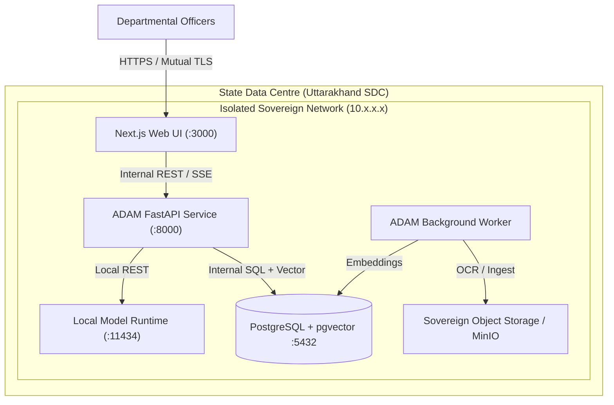

# ADAM Data Residency & Air-Gapped Operation Policy

**Target Entity:** Government of Uttarakhand / ITDA  
**Classification:** OFFICIAL / STATUTORY COMPLIANCE  
**Version:** 1.0.0 (October 2026)  

---

## 1. Principles of Sovereign Data Residency

ADAM is architected for strict jurisdictional data residency within the sovereign boundaries of the Republic of India:

1. **Zero External Data Egress:** All model inference, dense vector computation, embedding persistence, and OCR extraction execute locally on premises or within State Data Centre (SDC) infrastructure.
2. **Local Weight Execution:** Primary generation models (`Qwen/Qwen2.5-3B-Instruct`, `Qwen3-4B-Instruct`) and embedding vectorizers run via locally hosted Ollama or vLLM runtimes without API calls to offshore multi-tenant cloud providers.
3. **No External Telemetry:** All Next.js and library telemetry is disabled (`NEXT_TELEMETRY_DISABLED=1`).
4. **Air-Gap Capability:** The platform functions fully in physically or logically air-gapped environments without WAN connectivity once initial model weights and container images are staged.

---

## 2. Network Topology & Boundary Controls

- **Database Isolation:** PostgreSQL `5432` is not published to public or external subnets (`ports: !override []`). Communication is restricted to container-network socket connections.
- **SSRF Guard:** Web research agent features enforce strict private-IP and localhost resolution blocking (`adam/security/ssrf.py`) to prevent internal network traversal.
- **Hosted Voice Opt-in:** Cloud speech-to-text / text-to-speech services (e.g. Groq Whisper) require explicit opt-in via `ADAM_ALLOW_HOSTED_VOICE=true` and are disabled by default.

---

## 3. Storage Hierarchy

| Layer | Technology | Cryptographic Protection | Residency |
| :--- | :--- | :--- | :--- |
| **Document Store** | MinIO / POSIX FS | AES-256 server-side encryption | Local NVMe / SAN |
| **Vector DB** | PostgreSQL 16 + pgvector | Transparent Data Encryption (TDE) / dm-crypt | SDC Cluster |
| **Session Memory** | PostgreSQL `chat_turns` | Authenticated AES-GCM-256 (`MemoryCipher`) | SDC Cluster |
| **Audit Log** | PostgreSQL `audit_events` | SHA-256 cryptographic hash-chaining | Append-only store |
